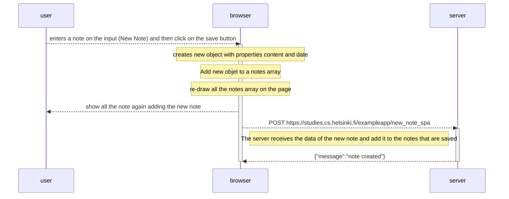

```mermaid
sequenceDiagram
		participant user
		participant browser
		participant server

		user-->>browser: enters a note on the input (New Note) and then click on the save button
		activate browser

		Note over browser: creates new object with properties content and date
		Note over browser: Add new objet to a notes array
		Note over browser: re-draw all the notes array on the page

		browser-->>user: show all the note again adding the new note

		browser-->>server: POST https://studies.cs.helsinki.fi/exampleapp/new_note_spa
		activate server


		Note left of server: The server receives the data of the new note and add it to the notes that are saved

		server-->>browser: {"message":"note created"}
		deactivate server
		deactivate browser
```
