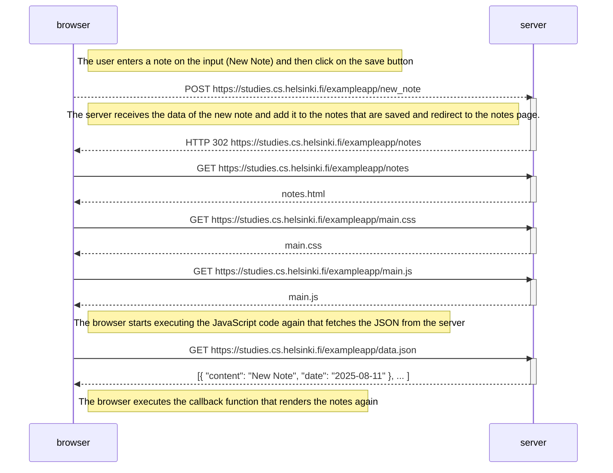

```mermaid
sequenceDiagram
		participant browser
		participant server

		Note right of browser: The user enters a note on the input (New Note) and then click on the save button

		browser-->>server: POST https://studies.cs.helsinki.fi/exampleapp/new_note
		activate server

		Note left of server: The server receives the data of the new note and add it to the notes that are saved and redirect to the notes page.

		server-->>browser: HTTP 302 https://studies.cs.helsinki.fi/exampleapp/notes
		deactivate server

		browser->>server: GET https://studies.cs.helsinki.fi/exampleapp/notes
    activate server
    server-->>browser: notes.html
    deactivate server

    browser->>server: GET https://studies.cs.helsinki.fi/exampleapp/main.css
    activate server
    server-->>browser: main.css
    deactivate server

    browser->>server: GET https://studies.cs.helsinki.fi/exampleapp/main.js
    activate server
    server-->>browser: main.js
    deactivate server

    Note right of browser: The browser starts executing the JavaScript code again that fetches the JSON from the server

    browser->>server: GET https://studies.cs.helsinki.fi/exampleapp/data.json
    activate server
    server-->>browser: [{ "content": "New Note", "date": "2025-08-11" }, ... ]
    deactivate server

    Note right of browser: The browser executes the callback function that renders the notes again

```
